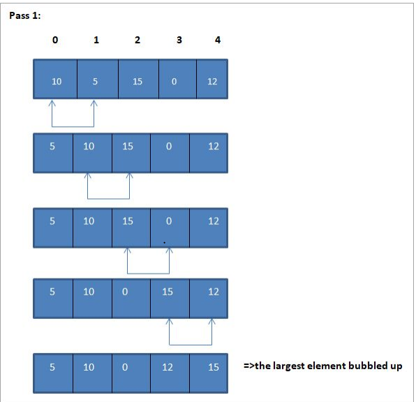

### BubbleSort
BubbleSort algorithm in a header file.

### How does this algorithm work?
1) the algorithm starts iterating an array and takes two element from it
2) checks if the element are in order, it they are it will remain as it is, if not, it will start swapping it until all is in order
### Here's a photo of how it works

### How to use the header file

`#include "bubblesort.h"` 

for calling the function just use `bubbleSort(*array*);`
